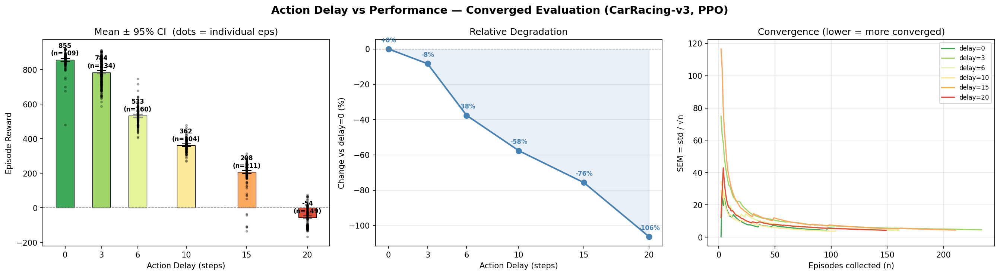

# 액션 딜레이가 강화학습 에이전트 성능에 미치는 영향
## CarRacing-v3 환경 기반 실험 보고서

**실험일**: 2026-06-13 ~ 2026-06-14  
**환경**: CarRacing-v3 (Gymnasium), PPO (stable-baselines3)  
**하드웨어**: NVIDIA TITAN RTX 24GB, Windows 11

---

## 1. 실험 목적

실제 자율주행·로봇 제어 시스템에서는 센서 처리 지연, 네트워크 레이턴시, 액추에이터 응답 지연 등으로 인해 에이전트가 보낸 액션이 즉시 반영되지 않는다. 본 실험은 **액션 딜레이(k 스텝)**가 학습된 PPO 에이전트의 성능에 미치는 영향을 정량적으로 측정한다.

---

## 2. 실험 환경

### 2.1 시뮬레이션 환경

| 항목 | 내용 |
|------|------|
| 환경 | Gymnasium `CarRacing-v3` |
| 관측 | 96×96 RGB 이미지 (top-down 뷰) |
| 액션 | 연속값 3차원 `[steer, gas, brake]` |
| 보상 | 트랙 타일 통과 시 +1/tile, 매 스텝 -0.1 |
| 에피소드 최대 길이 | 1,000 스텝 |

### 2.2 딜레이 래퍼 구조

```
에이전트 → action_t → [버퍼] → action_{t-k} → 환경
```

딜레이 주입에는 `gymnasium_delay` 패키지의 **`ObsActDelayWrapper`**를 사용한다. 액션을 FIFO 버퍼에 넣고 k 스텝 전 액션을 환경에 전달하며, 본 실험은 액션 딜레이(`act_delay=k`)만 적용했다. 이 래퍼는 관측 딜레이(`obs_delay`)와 확률적 딜레이 분포(`RoundedNormalDelay`, `RoundedUniformDelay`)도 지원하여 향후 stochastic 딜레이 실험으로 확장 가능하다. 에피소드 시작 시 버퍼는 중립(zero) 액션으로 초기화된다.

### 2.3 에이전트 학습

| 항목 | 값 |
|------|-----|
| 알고리즘 | PPO (CnnPolicy) |
| 총 학습 스텝 | 5,000,000 |
| 병렬 환경 수 | 8 (SubprocVecEnv) |
| n_steps | 512 |
| batch_size | 256 |
| learning_rate | 3e-4 |
| target_kl | 0.02 |
| 학습 환경 | 딜레이 없음 (k=0) |
| 학습 시간 | 약 7시간 42분 (~180 FPS) |

---

## 3. 학습 과정

### 3.1 보상 곡선 (eval, deterministic)

| 스텝 | eval 보상 | 비고 |
|------|----------:|------|
| 0    | 초기 | 랜덤 정책 |
| ~600k | +526 | 급격한 성능 향상 |
| ~1.0M | +733 | 지속 상승 |
| **~1.8M** | **+849.9** | **최고 성능 (best_model 저장)** |
| ~2.0M | +795 | 성능 안정화 |
| ~3.0M | +600대 | 정책 진동 시작 |
| 5.0M  | +187 | 최종 (진동으로 하락) |

### 3.2 학습 특이사항

- **1.8M 스텝 기준 peak**: eval 849.90 ± 36.46 달성 후 정책 진동(oscillation) 발생
- **target_kl=0.02** 효과: 다수 iteration에서 "Early stopping at step 0" 발동 → KL 폭발 방지
- best_model은 EvalCallback이 1.8M 스텝 시점에 자동 저장
- 최종 5M 모델은 진동으로 하락하여 딜레이 실험에는 best_model 사용

### 3.3 미세조정 시도 (실패)

855가 solved 기준(900)에 못 미쳐, best_model에서 **LR 5e-5→0 선형 감쇠**로 2M 스텝 추가 미세조정을 시도했다. 결과:

- 미세조정 첫 eval(50k)부터 **741로 하락**, 이후 230~805 사이 격렬히 진동
- 2M 전 구간 최고 eval은 **804.7** (1.55M 지점) — **원본 855에 못 미침**
- eval std가 110~300으로 끝까지 높음 → 정책이 안정화되지 못함

LR을 6배 낮추고 0으로 감쇠시켜도 본학습과 동일한 불안정성이 재현됐다. **855 정책은 좁고 날카로운 최적점**에 위치해, 부드러운 PPO 업데이트로도 한 번 밀려나면 그 봉우리로 복귀하지 못한다.

> **결론**: 원본 best_model(855) 유지. 900 도달은 처음부터 다른 학습 설계(frame stacking, 초기부터 LR 감쇠, VecNormalize 등)가 필요하며 별도 과제다. 855는 딜레이 연구 baseline으로 충분히 강건하다.

---

## 4. 딜레이 실험 결과 (수렴 기반 평가)

**사용 모델**: `best_model/best_model.zip` (eval 849.90, 1.8M steps)  
**평가 방식**: 고정 에피소드 수가 아니라 **SEM 기반 정지 규칙**으로 평균이 수렴할 때까지 에피소드를 추가 수집.

### 4.1 수렴 정지 규칙

각 delay마다 분산이 다르므로 필요한 에피소드 수도 다르다. 다음 조건을 만족하면 수렴으로 판정한다:

> n ≥ 30 이고 **SEM = std/√n < 5.0** (보상 점수 기준)이 16 에피소드 연속 유지

이는 평균의 **95% 신뢰구간 반폭(1.96·SEM)을 약 10점 이내**로 좁힌다는 의미다. 8개 병렬 환경(SubprocVecEnv)으로 에피소드를 동시 수집했다.

### 4.2 결과 요약

| delay | n (수렴) | 평균 보상 | 95% CI± | 중앙값 | 실패율* | std | delay=0 대비 |
|:-----:|:-------:|----------:|--------:|-------:|:------:|----:|:-----------:|
| 0  | 109 | **855.2** | ±10.3 | 864.8 | 0%  | 55.1 | 기준 |
| 3  | 234 | 783.7 | ±8.9  | 785.5 | 0%  | 69.8 | **-8.4%** |
| 6  | 160 | 533.2 | ±8.3  | 532.3 | 0%  | 53.6 | **-37.6%** |
| 10 | 104 | 362.2 | ±7.3  | 362.2 | 0%  | 37.9 | **-57.6%** |
| 15 | 211 | 207.6 | ±8.5  | 220.0 | 3%  | 63.4 | **-75.7%** |
| 20 | 149 | **-54.4** | ±8.4  | -44.6 | **85%** | 52.2 | **-106.4%** |

*실패율 = 보상 < 0 인 에피소드 비율 (레이싱 실패)



> 그래프 오른쪽 패널: 모든 delay의 SEM 곡선이 목표선(5.0) 아래로 떨어져 평탄화됨 — 평균이 수렴했다는 직접적 증거.

### 4.3 6개 delay 모두 수렴 확인

이전 20-에피소드 실험에서 **delay=20은 SEM이 너무 커서 평균이 수렴하지 않았다**(20 에피소드 기준 -64.8 ± 49.8, SEM ≈ 11.1). 이번 수렴 기반 평가에서 149 에피소드까지 수집한 결과 SEM=4.28로 떨어지며 **평균이 -54.4 ± 8.4로 수렴**했다. 이전 추정치(-64.8)는 표본이 작아 우연히 낮게 잡혔던 값으로 확인됐다.

---

## 5. 분석

### 5.1 딜레이-성능 관계: 비선형 절벽

delay=3 구간까지는 성능 저하가 완만하다(-8.4%, 실패율 0%). 그러나 **delay=3→6 구간에서 급격한 절벽(cliff)**이 나타난다(-8.4% → -37.6%). 이는 단기 딜레이에서는 에이전트가 관성·예측으로 보상하지만, 약 4~5 스텝 임계값을 넘으면 피드백 루프가 붕괴하는 것을 시사한다.

이후 거의 선형적으로 하락하여 delay=20에서 음수 보상에 도달한다.

### 5.2 delay=20은 "수렴했지만 거의 항상 실패"

delay=20의 평균 -54.4는 수렴했으나, 그 의미를 정확히 보려면 분포를 봐야 한다:

- **실패율 85%**: 149 에피소드 중 85%가 음수 보상 (트랙 이탈)
- **평균(-54.4) < 중앙값(-44.6)**: 좌측으로 치우친 분포. 최저 -166까지 떨어지는 파국적 실패가 평균을 끌어내림
- **최대 +75**: 운 좋게 일부 트랙에서만 잠깐 버팀

즉 delay=20은 "평균적으로 약간 나쁜" 것이 아니라 **"거의 항상 완전 실패하고, 드물게 간신히 버티는"** 상태다. 단일 평균값보다 **실패율(85%)**이 이 상태를 더 정확히 기술한다.

### 5.3 왜 딜레이가 성능을 떨어뜨리는가

1. **시간적 불일치**: 에이전트는 현재 관측 o_t로 액션을 결정하지만, 환경에는 k 스텝 전 관측 기준 액션 a_{t-k}가 들어간다.
2. **POMDP로의 전환**: 딜레이가 있으면 에이전트는 미래 상태를 예측해 액션해야 하는 부분 관측 문제(POMDP)를 풀게 된다.
3. **누적 오차**: 잘못된 액션이 이후 k 스텝 동안 지속 반영되어 오류가 연쇄 증폭된다. 고속 코너링에서 특히 치명적.

### 5.4 통계적 엄밀성

이전 실험(고정 10~20 에피소드)과 달리, 이번 평가는 SEM 기반 정지 규칙으로 **6개 delay 모두 95% CI 반폭을 ±7~10점 이내로 수렴**시켰다. delay별 수렴 에피소드 수(81~234)가 분산에 따라 자동 조절된 것이 특징이다 — 분산이 낮은 delay=10은 81 에피소드, 분산이 큰 delay=3은 234 에피소드가 필요했다.

### 5.5 주행 시각화 (GIF)

같은 트랙(seed 고정)에서 delay 0/6/10/20을 나란히 주행시킨 비교 영상:


동일 트랙·동일 정책인데도 delay만 다르게 주면 600 스텝 시점 누적 보상이 **514 / 288 / 194 / 3**으로 벌어진다. delay=0은 도로 중앙을 따라가지만, delay=20은 도로를 완전히 벗어나 잔디밭에서 제자리를 맴돈다 — 시간적 불일치가 누적되어 피드백 제어가 붕괴하는 모습을 직접 확인할 수 있다.

---

## 6. 결론

1. **딜레이 3 스텝까지는 허용 가능**: -8.4%, 실패율 0%로 실용적 운용 가능.
2. **임계 구간(3→6 스텝)에서 성능 절벽**: -37.6%로 급락.
3. **delay≥15에서 파국적 실패 시작**: delay=15 실패율 3%, **delay=20 실패율 85%**.
4. **수렴 기반 평가의 가치**: delay=20처럼 분산이 큰 케이스는 고정 표본으로는 평균이 불안정하다. SEM 정지 규칙으로 6개 delay 모두 신뢰할 만한 추정치를 얻었다.
5. **대응 방법**: 딜레이 환경에서 강건한 에이전트를 얻으려면 학습 시 동일한 딜레이 래퍼 적용, 또는 관측에 과거 액션 히스토리를 추가하는 augmented state 기법을 사용해야 한다.

---

## 7. 재현 방법

프로젝트 구조:

```
delay/
├── src/      train.py · finetune.py · eval_converge.py · make_gif.py · common.py
├── models/   best_model/ · best_model_ft/ · *.zip
├── results/  report.md · delay_converged.png/json · delay_compare.gif
└── runs/     tb_logs/ · logs/ · checkpoints/ ...
```

모든 스크립트는 **프로젝트 루트에서** 실행한다 (경로는 `common.py`가 절대경로로 관리).

```bash
pip install gymnasium[box2d] stable-baselines3 torch pygame
pip install -e C:/DOG/delaywrapper   # gymnasium_delay (ObsActDelayWrapper)

# 학습 (GPU, 8 병렬 환경)
python src/train.py --n-envs 8 --timesteps 5000000 --device cuda

# 딜레이 실험 (수렴 기반 평가)
python src/eval_converge.py --delays 0 3 6 10 15 20 --sem-target 5.0

# 주행 비교 GIF
python src/make_gif.py --delays 0 6 10 20

# TensorBoard
tensorboard --logdir runs/tb_logs
```

---

*그래프: `delay_converged.png` · 원시 데이터: `delay_converged.json` · 주행 영상: `delay_compare.gif`*
